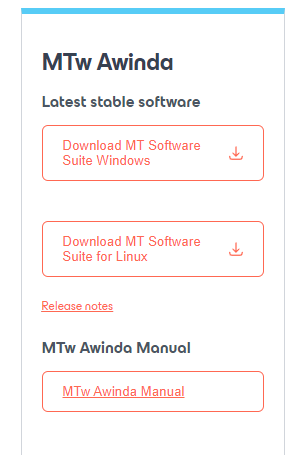

# Xsens MTw XDA Receive Python Example

This Python example was based on the _MTSDK/examples/mtsdk/xda_cpp/example_mtw.cpp_

It was tested with Python 3.8 in Windows 11 and ubuntu 20.04(VirtualBox) with **Awinda Dongle** and 4 MTw sensors(or Xsens DOT Pro).

### Note:
For the MATLAB version, please go the the [`matlab`](https://github.com/jiminghe/Xsens_MTw_XDA_Receive/tree/matlab) branch

### Dependencies:
```
pip install keyboard
```

Xsens Device API is needed, which is included in the MT SDK folder of **MT Software Suite 2022.2**(under the MTw Awinda section, see below picture), download from
https://www.movella.com/support/software-documentation


```
pip install xsensdeviceapi-2022.2.0-cp38-none-win_amd64.whl
```
In ubuntu, you may need to uncomment these lines, because there might be error: _no Modules found_:
```
module_path = "/home/<yourusername>/.local/lib/python3.8/site-packages/"
sys.path.insert(0, module_path)
import xsensdeviceapi.xsensdeviceapi_py38_64 as xda`
```

### Usage:
**Linux**
```
sudo python3 xdamtwreceive.py
```
**Windows**
```
python xdamtwreceive.py
```

### Notes:
if you want to align the initial heading among multiple sensors, or doing heading reset, you need to firstly physically align these sensors with the same heading,
then you could uncomment these lines(line 257 to 260):
```
else:
    print("Do heading reset before recording data, make sure all sensors have aligned physically the same heading!!")
    all([mtw_devices[i].resetOrientation(xda.XRM_Heading) for i in range(len(mtw_callbacks))])
```


MIT License
-----------
Permission is hereby granted, free of charge, to any person obtaining a copy of this software and associated documentation files (the "Software"),
to deal in the Software without restriction, including without limitation the rights to use, copy, modify, merge, publish, distribute,
sublicense, and/or sell copies of the Software, and to permit persons to whom the Software is furnished to do so, subject to the following conditions:
The above copyright notice
and this permission notice shall be included in all copies or substantial portions of the Software.
THE SOFTWARE IS PROVIDED "AS IS",
WITHOUT WARRANTY OF ANY KIND, EXPRESS OR IMPLIED,
INCLUDING BUT NOT LIMITED TO THE WARRANTIES OF MERCHANTABILITY,
FITNESS FOR A PARTICULAR PURPOSE AND NONINFRINGEMENT.
IN NO EVENT SHALL THE AUTHORS OR COPYRIGHT HOLDERS BE LIABLE FOR ANY CLAIM,
DAMAGES OR OTHER LIABILITY,
WHETHER IN AN ACTION OF CONTRACT,
TORT OR OTHERWISE,
ARISING FROM,
OUT OF OR IN CONNECTION WITH THE SOFTWARE OR THE USE OR OTHER DEALINGS IN THE SOFTWARE.
